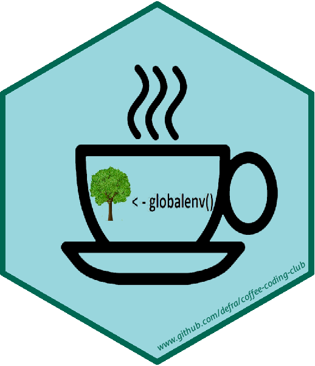

# Coffee & Coding
### _14/02/2020_

A _public_ repository to hold resources and notes from Coffee & Coding sessions.

### Contributing 
Note that resources are _publicly accessible_. When adding new content clone or fork the repo, work on a branch, and submit a pull request. 

Folders should adhere to the following conventions:

* `YYYYMMDD_Topic_Name`
* All folders should contain a `README.md` with notes or a brief explanation

DfE have guidance on using GitHub via the Git GUI and HTTPS [here](https://github.com/dfe-analytical-services/coffee-and-coding/blob/master/how-to-use-github.md). For those who want a more in depth R focussed tutorial we recommend [happy git with r](https://happygitwithr.com/) by Jenny Bryan et al of the University of British Columbia.

The most recent talk materials can be seen above and any materials from talks prior to these can be found in the **Archived_materials** folder. 

### Aim
The aim of the Coffee & Coding meetups is to nurture, enable and encourage a vibrant, supportive and inclusive coding community at Defra. Coffee & Coding provides a regular opportunity for people within Defra who are interested in coding to share skills and knowledge, provide advice and guidance to each other and generally network and get to know each other. The format is generally 40 minutes for a presentation and questions to the presenter/s followed by 20 minutes Code Surgery. The presentations usually take the form of a demonstration of a tool or technique and/or a show and tell of work done within the department using these methods. From time to time we will invite external speakers. The Code Surgery provides the opportunity for people to pose any coding related queries/ruminations/ideas to the gathered coding community.

### Coffee & Coding Schedule

| Date            | Time  | Room    | Title                                                        | Presenter                                     | Abstract                                                     |
| :-------------- | :---- | :------ | :----------------------------------------------------------- | :-------------------------------------------- | :----------------------------------------------------------- |
| Monday 24 Feb 2020 | 12:00 | FH: CRO7, 2MS: SG42 | 'sdcTable' package | Adam Goude  | Demonstrating use of the package "sdcTable", whic he has used to apply first and secondary statistical suppresion on a table. |
| Monday 6 Apr 2020 | 12:00 | Webex Only | 'leaflet' package | Anthony Walker  | Demonstrating use of the package "leaflet", which is one of the most popular open-source JavaScript libraries for interactive maps. |

###### *format forked from www.github.com/departmentfortransport/coffee-and-coding*
